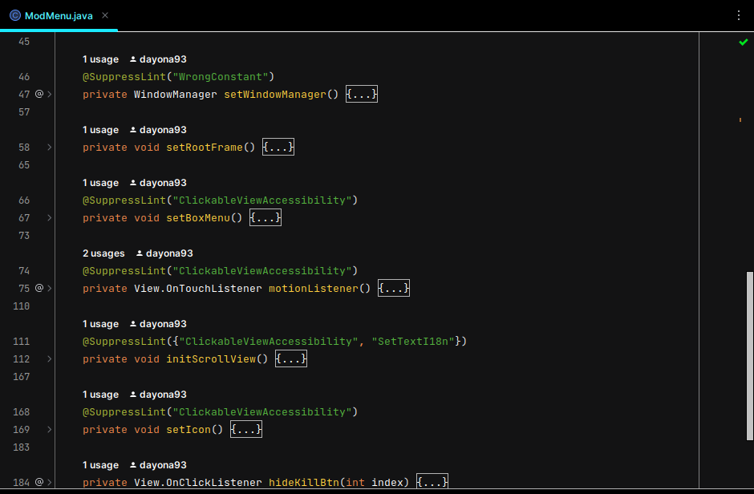
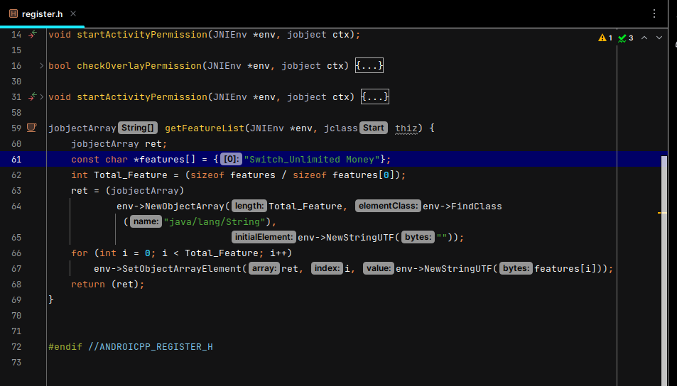
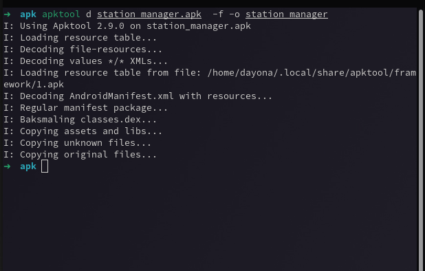
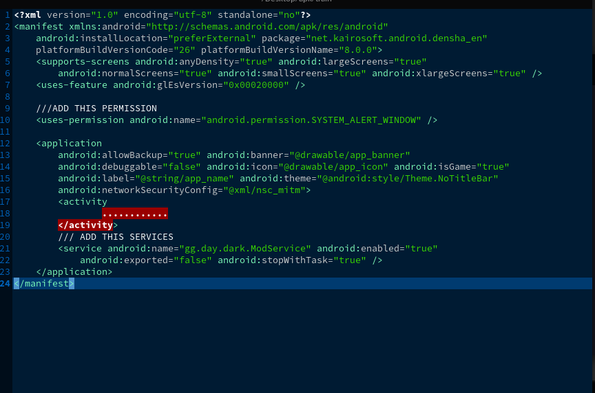

# darkmod

This is a simple template for the usage of Dobby with a Mod Menu written in Java and C++

### Not For Noobs

### REQUIRED

1. A Brain
2. Java Skill ( Intermediate )
3. C++ Skill ( Intermediate )
4. Smali Skill ( Basic )
5. Apktool
6. Il2CppDumper

### Tutorial:

* https://guidedhacking.com/threads/function-pointers-and-a-tutorial-for-my-hooking-template.14771/#post-90490

This is how the menu looks like when you simply build and run it
You can editing menu what you want here

Register your mod menu here

Test Game

Test from game Kairosoft
<a href="https://happymod.com/station-manager-app-mod/net.kairosoft.android.densha_en/original-download.html" title="Station Manager">
Station Manager</a>

### Step to embed mod into game

1. decompile game apk

   

2. edit game manifest

   
3. embed mod to game smali

   

### Credits:

Thanks to Dobby https://github.com/jmpews/Dobby

