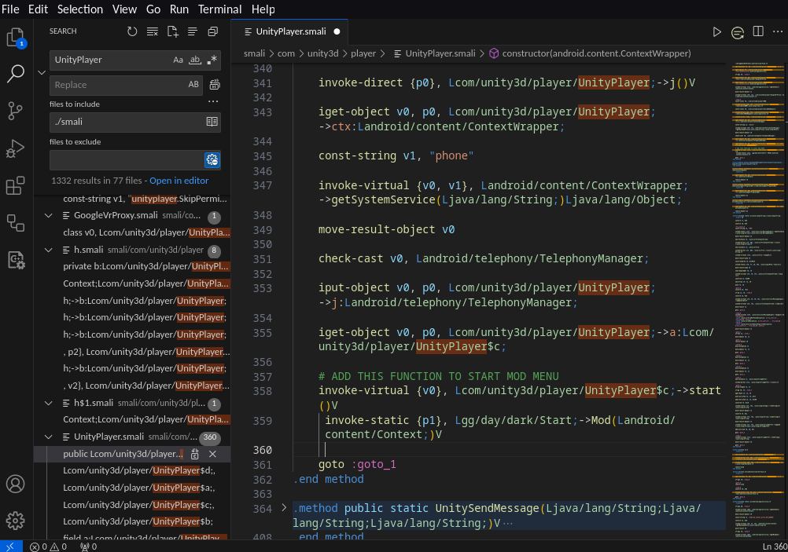

# **darkmod**

### Testing Game

This is a simple template for the usage of Dobby with a Mod Menu written in Java and C/C++

### Not For Noobs

### Only for Armv7, Arm64 Coming Soon

### REQUIRED

1. A Brain
2. Java Skill ( Intermediate )
3. C++ Skill ( Intermediate )
4. Smali Skill ( Basic )
5. [ApkTool](https://github.com/dayonaart/darkmod/blob/main/tools/apktool.jar)
6. [Il2CppDumper](https://github.com/dayonaart/darkmod/blob/main/tools/Il2CppDumper.zip)

### Tutorial:

* https://guidedhacking.com/threads/function-pointers-and-a-tutorial-for-my-hooking-template.14771/#post-90490

This is how the menu looks like when you simply build and run it
You can editing menu what you want here

Register your mod menu here

Test game from Kairosoft
<a href="https://happymod.com/station-manager-app-mod/net.kairosoft.android.densha_en/original-download.html" title="Station Manager">
Station Manager</a>

### Step to embed mod into game

1. decompile game apk

   

2. edit game manifest

   
3. embed mod into smali code

   

### Credits:

Thanks to Dobby https://github.com/jmpews/Dobby

